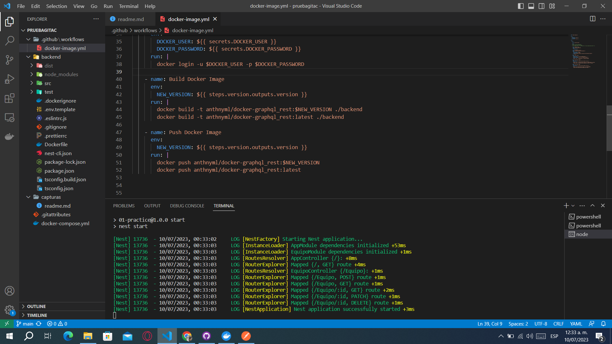

#Practica 8 - GitActions

Rest + GitActions- Número en la lista: 25 - Moreira Lucas Luis Anthony 9'A'
Tema: Manejo de Piezas Hardware 
Entidad:Equipo
Atributos: {Id, Descripción, Características}

El presente proyecto fue creado con Nest, PostgretSQL

------------------------------------------------------------------------------------------

Como usar: 

*Para instalar*
Ejecutar desde la carpeta backend
 - npm install

Nota: Es importante hacerlo en terminal "CMD" o VSC "Command Prompt"

*Para ejecutar dentro de la carpeta de "api-gateway" y el microservicio "equipo"* 
 - npm run start 

En Postman dirigirse a 
 - http://localhost:3000/equipo 

-------------------------------------------------------------------------------------------

Capturas:
REST API

